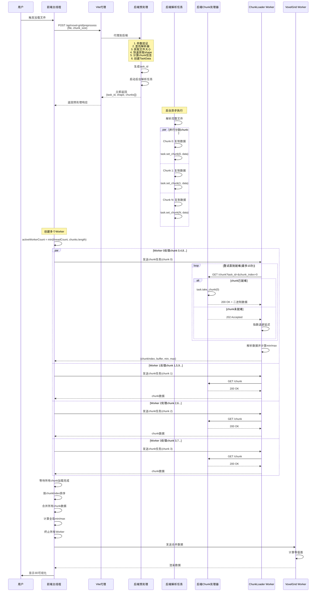
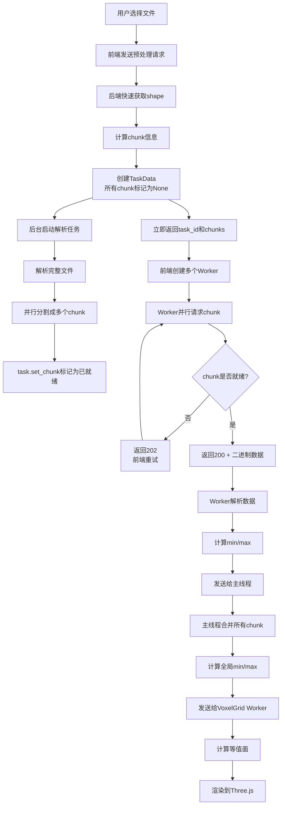
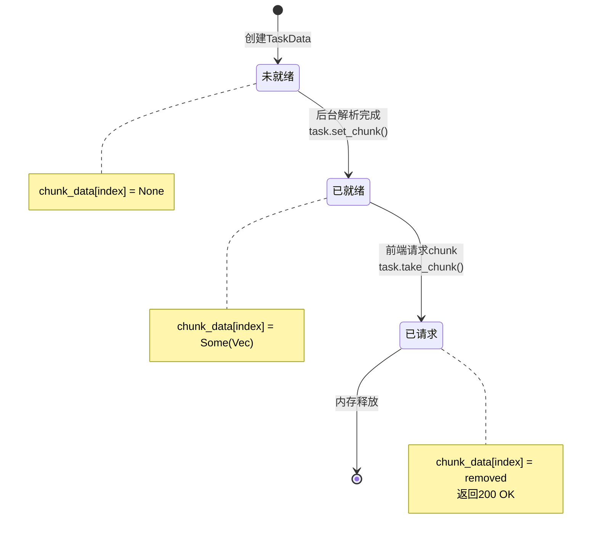
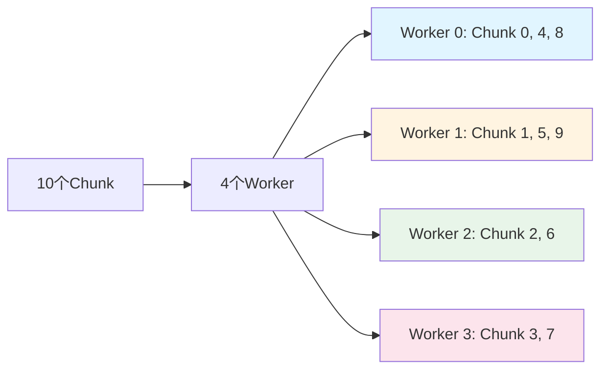

# Chunk数据处理流程图

## 完整流程图

```mermaid
sequenceDiagram
    participant User as 用户
    participant Frontend as 前端主线程
    participant Vite as Vite代理
    participant BackendPreprocess as 后端预处理
    participant BackendParse as 后端解析任务
    participant BackendChunk as 后端Chunk处理器
    participant Worker as ChunkLoader Worker
    participant VoxelWorker as VoxelGrid Worker

    User->>Frontend: 触发加载文件
    Frontend->>Vite: POST /api/voxel-grid/preprocess<br/>{file, chunk_size}
    Vite->>BackendPreprocess: 代理到后端
    
    Note over BackendPreprocess: 1. 参数验证<br/>2. 查找解析器<br/>3. 获取文件大小<br/>4. 快速获取shape<br/>5. 计算chunk信息<br/>6. 创建TaskData
    
    BackendPreprocess->>BackendPreprocess: 生成task_id
    BackendPreprocess->>BackendPreprocess: 启动后台解析任务
    
    BackendPreprocess-->>Vite: 立即返回<br/>{task_id, shape, chunks[]}
    Vite-->>Frontend: 返回预处理响应
    
    Note over BackendParse: 后台异步执行
    BackendParse->>BackendParse: 解析完整文件
    par 并行分割chunk
        BackendParse->>BackendParse: Chunk 0: 复制数据
        BackendParse->>BackendParse: task.set_chunk(0, data)
    and
        BackendParse->>BackendParse: Chunk 1: 复制数据
        BackendParse->>BackendParse: task.set_chunk(1, data)
    and
        BackendParse->>BackendParse: Chunk N: 复制数据
        BackendParse->>BackendParse: task.set_chunk(N, data)
    end
    
    Note over Frontend: 创建多个Worker
    Frontend->>Frontend: activeWorkerCount = min(threadCount, chunks.length)
    
    par Worker 0处理chunk 0,4,8...
        Frontend->>Worker: 发送chunk任务(chunk 0)
        loop 重试直到就绪(最多10次)
            Worker->>BackendChunk: GET /chunk?task_id=&chunk_index=0
            alt chunk已就绪
                BackendChunk->>BackendChunk: task.take_chunk(0)
                BackendChunk-->>Worker: 200 OK + 二进制数据
            else chunk未就绪
                BackendChunk-->>Worker: 202 Accepted
                Worker->>Worker: 指数退避延迟
            end
        end
        Worker->>Worker: 解析数据并计算min/max
        Worker-->>Frontend: {chunkIndex, buffer, min, max}
    and Worker 1处理chunk 1,5,9...
        Frontend->>Worker: 发送chunk任务(chunk 1)
        Worker->>BackendChunk: GET /chunk
        BackendChunk-->>Worker: 200 OK
        Worker-->>Frontend: chunk数据
    and Worker 2处理chunk 2,6...
        Frontend->>Worker: 发送chunk任务(chunk 2)
        Worker->>BackendChunk: GET /chunk
        BackendChunk-->>Worker: 200 OK
        Worker-->>Frontend: chunk数据
    and Worker 3处理chunk 3,7...
        Frontend->>Worker: 发送chunk任务(chunk 3)
        Worker->>BackendChunk: GET /chunk
        BackendChunk-->>Worker: 200 OK
        Worker-->>Frontend: chunk数据
    end
    
    Frontend->>Frontend: 等待所有chunk加载完成
    Frontend->>Frontend: 按chunkIndex排序
    Frontend->>Frontend: 合并所有chunk数据
    Frontend->>Frontend: 计算全局min/max
    Frontend->>Frontend: 终止所有Worker
    
    Frontend->>VoxelWorker: 发送合并数据
    VoxelWorker->>VoxelWorker: 计算等值面
    VoxelWorker-->>Frontend: 渲染数据
    Frontend->>User: 显示3D可视化
```

## 数据流图

```mermaid
graph TD
    A[用户选择文件] --> B[前端发送预处理请求]
    B --> C[后端快速获取shape]
    C --> D[计算chunk信息]
    D --> E[创建TaskData<br/>所有chunk标记为None]
    E --> F[立即返回task_id和chunks]
    F --> G[前端创建多个Worker]
    
    E --> H[后台启动解析任务]
    H --> I[解析完整文件]
    I --> J[并行分割成多个chunk]
    J --> K[task.set_chunk标记为已就绪]
    
    G --> L[Worker并行请求chunk]
    L --> M{chunk是否就绪?}
    M -->|否| N[返回202<br/>前端重试]
    M -->|是| O[返回200 + 二进制数据]
    N --> L
    O --> P[Worker解析数据]
    P --> Q[计算min/max]
    Q --> R[发送给主线程]
    
    R --> S[主线程合并所有chunk]
    S --> T[计算全局min/max]
    T --> U[发送给VoxelGrid Worker]
    U --> V[计算等值面]
    V --> W[渲染到Three.js]
```

## 状态流转图

```mermaid
stateDiagram-v2
    [*] --> 未就绪: 创建TaskData
    未就绪 --> 已就绪: 后台解析完成<br/>task.set_chunk()
    已就绪 --> 已请求: 前端请求chunk<br/>task.take_chunk()
    已请求 --> [*]: 内存释放
    
    note right of 未就绪
        chunk_data[index] = None
    end note
    
    note right of 已就绪
        chunk_data[index] = Some(Vec<f64>)
    end note
    
    note right of 已请求
        chunk_data[index] = removed
        返回200 OK
    end note
```

## Worker分配策略

```mermaid
graph LR
    A[10个Chunk] --> B[4个Worker]
    B --> C[Worker 0: Chunk 0, 4, 8]
    B --> D[Worker 1: Chunk 1, 5, 9]
    B --> E[Worker 2: Chunk 2, 6]
    B --> F[Worker 3: Chunk 3, 7]
    
    style C fill:#e1f5ff
    style D fill:#fff4e1
    style E fill:#e8f5e9
    style F fill:#fce4ec
```

